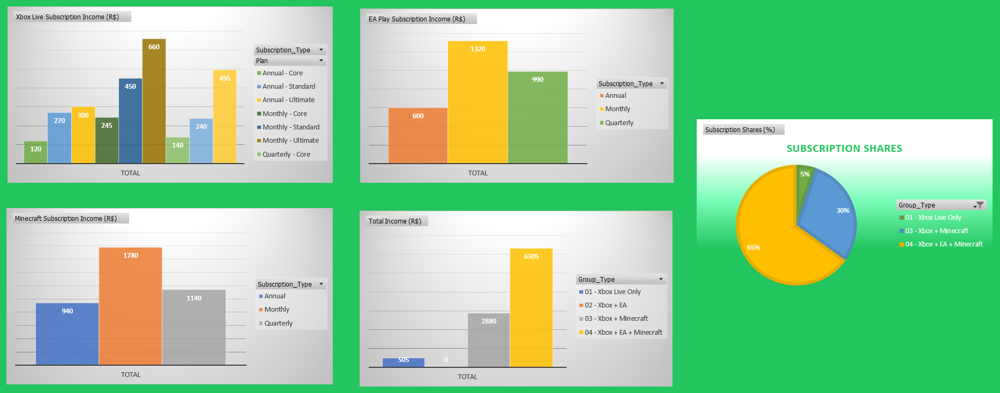

# Creating an Xbox Sales Dashboard



This repository was created for the Project Creating an Xbox Sales Dashboard.
The project goal is to organize, analyze, and visualize subscriptions data from an Xbox platform database to transform raw data into a well-structured Excel dashboard.

## Project Overview

The project involves the following phases:

### Phase 1: Initial Database Transformation
The raw data is provided in the file `base_de_dados.xlsx`. This file is analyzed and converted into an SQL-compatible format, resulting in the script `xbox_dashboard.sql`, which creates the database and tables in MySQL.

### Phase 2: Database Adjustments
The SQL database is further refined and implemented locally using a MySQL server. Adjustments include table optimizations and adding any necessary constraints or indexes for efficient querying.

### Phase 3: Query Design
Key business questions are formulated to extract meaningful insights from the database. Corresponding SQL queries are written and stored in the `queries/` directory. These queries address specific aspects of sales performance and trends.

### Phase 4: Data Extraction
Query results are exported from MySQL into a new Excel file, `loaded_xbox_dashboard.xlsx`, which serves as the foundation for the dashboard.

### Phase 5: Dashboard Creation
Using the query results, the `loaded_xbox_dashboard.xlsx` file is implemented with pivot tables and pivot charts to create a comprehensive Xbox Sales Dashboard.

## Dashboard Features
- **Xbox Live Subscription Income:** Breakdown of Xbox Live Core, Standard and Ultimate subscriptions by month, quarter and year results.
- **EA Play Subscription Income:** Breakdown of EA Play subscriptions by month, quarter and year results.
- **Minecraft Subscription Income:** Breakdown of Minecraft subscriptions by month, quarter and year results.
- **Total Income:** Total Income from subscription sales separated by Xbox Only, Xbox + EA, Xbox + Minecraft and Xbox + EA + Minecraft.
- **Subscription Shares:** Market share subscription insights for Xbox Only, Xbox + EA, Xbox + Minecraft and Xbox + EA + Minecraft.

## Setup Instructions

### Prerequisites
- MySQL server installed
- Access to a MySQL client or GUI
- Microsoft Excel (or a compatible alternative)
- Internet access and link to [tableconvert.com](https://tableconvert.com/)

### Steps to Reproduce
1. **Clone the Repository:**
   ```bash
   git clone https://github.com/your-repo/xbox_sales_dashboard
   ```   

2. **Convert `base_de_dados.xlsx` using tableconvert.com:**\
     Export your database XLSX file to the website and convert it to `xbox_dashboard.sql`.

3. **Import and transform the Database Schema for future queries:**
   ```bash
   mysql -u [your_user] -p < xbox_dashboard.sql
   ```

4. **Run core question queries:**\
   Execute individual query scripts to extract data from `xbox_dashboard.sql`. For example:
   ```bash
   mysql -u [your_user] -p < queries/01_xbox_live_reports.sql
   ```    
5. **Export Data to Excel:**\
   Export the results of the queries from MySQL and save them in `loaded_xbox_dashboard.xlsx`.

6. **Create pivot tables and pivot charts in Excel:**\
   Use Microsoft Excel to start working on `loaded_xbox_dashboard.xlsx` and create pivot charts from imported query resultos from MySQL to implement on the Dashboard later.
   
7. **Create the Dashboard based on the pivot assets created:**\
   Prepare the pivot assets on `loaded_xbox_dashboard.xlsx` and format the dashboard interface as needed.

## Contact
For questions or suggestions, feel free to reach out at [rmjo.inbox@gmail.com](mailto:rmjo.inbox@gmail.com) or via my GitHub Inbox.

